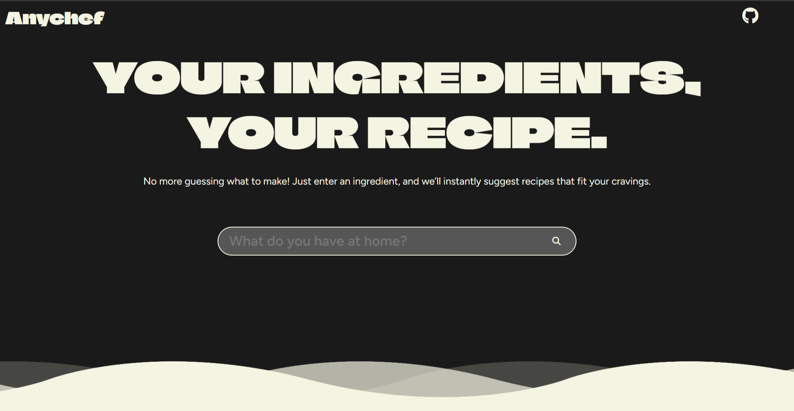

# Anychef

**Anychef** is a lightweight, intuitive recipe-finding prototype that helps users discover a variety of meal ideas based on available ingredients. Designed for simplicity and speed, Anychef enables users to input thier main ingredient and retrieve a curated list of recipes via the MealDB API.

This project is implemented using **HTML**, **CSS**, and **JavaScript**, with no external dependencies or frameworks—making it an ideal prototype for rapid deployment or educational use.

---

## ⚠️ Disclaimer
This project is a prototype developed exclusively for educational purposes and is not intended for production deployment. It does not represent a fully functional or validated application. Users are advised not to rely on this tool for actual cooking, recipe preparation, or dietary decisions.

## 📌 Features

- **Ingredient-Based Search**  
  Enter a single ingredient to instantly retrieve relevant recipes.

- **API Integration**  
  Utilizes the [MealDB API](https://www.themealdb.com/) to access a rich database of global recipes.

- **Responsive Design**  
  Built with mobile-first responsiveness for seamless browsing across all devices.

- **Minimalist Interface**  
  Clean, user-friendly layout focused entirely on delivering recipes with no distractions.

---

## 🔧 Technologies Used

- **HTML** – Structural markup
- **CSS** – Custom styling and layout
- **JavaScript** – Logic handling and API interaction
- **MealDB API** – External recipe data source

---

## 🖥️ Getting Started

To run the project locally:

1. **Clone the repository**

   ```bash
   git clone https://github.com/nitintonypaul/Anychef.git
   ```

2. **Navigate to the project directory**

   ```bash
   cd Anychef
   ```
3. **Launch the Web Application**

   Launch the index.html file in your preferred browser.
   
---

## 📷 Preview


---

## 🌐 Acknowledgments
- TheMealDB API for providing a free and rich collection of recipes.
  

